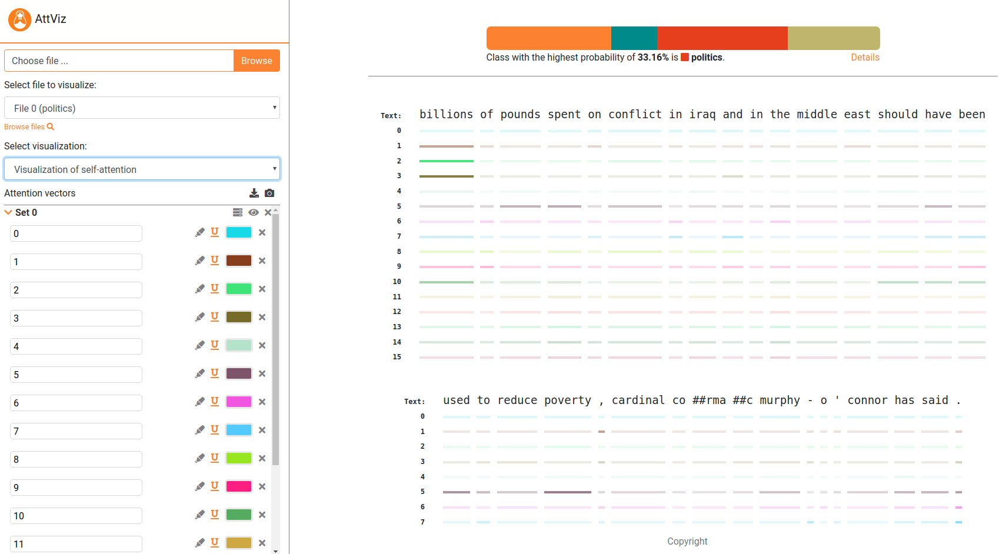

# _AttViz_ - Self attention made *simple*


Neural language models are the state-of-the-art for most language-related tasks. One of the ways to explore their behavior, however, is via _visualization_. We present AttViz, a simple webserver suitable for *exploration* of instance-level attention, online.
The server is live at [AttViz](http://attviz.ijs.si).

Current preprint:
```
@misc{krlj2020attviz,
    title={AttViz: Online exploration of self-attention for transparent neural language modeling},
    author={Blaž Škrlj and Nika Eržen and Shane Sheehan and Saturnino Luz and Marko Robnik-Šikonja and Senja Pollak},
    year={2020},
    eprint={2005.05716},
    archivePrefix={arXiv},
    primaryClass={cs.LG}
}
```


# Requirements
To follow the example below, please install the requirements from requirements.txt, by doing e.g.,
```
pip install -r requirements.txt
```

AttViz is fully compatible with [pytorch_transformers](https://github.com/huggingface/transformers) library!
# How to prepare inputs?
AttViz accepts attention space, encoded in the form of JSON objects, that can be constructed by using the provided scripts. An end-to-end example, which first trains a BERT-based model on a multiclass classification task, and next uses it to obtain attention data
is given next.

```python

## first build a model, then generate server input.
from generate_server_input import *
from build_bert_classifier import *

##  STEP 1: A vanilla BERT-base model.
train_seq, dev_seq, train_tar, dev_tar = read_dataset("data","hatespeech") ## hatespeech or bbc are in the repo!

bert_model = get_bert_base(train_seq, dev_seq, train_tar, dev_tar, weights_dir = "transformer_weights", cuda = False) ## for cuda, you might need the apex library

##  STEP 2: Predict, attend to and generate final json.
weights = "transformer_weights" ## Any HuggingFace model dump can be used!
test_data = "data/hatespeech/test.tsv"
delimiter = "\t"
text_field = "text_a"
label_field = "label"
number_of_attention_heads = 12
label_names = ["no","some","very","disturbing"] #['business','entertainment','politics','sport']
segment_delimiter = "|||"

## Obtain the attention information and create the output object.
## Subsample = True takes each 10th sample, useful for prototyping.

model = BertForSequenceClassification.from_pretrained(weights,
                                                          num_labels = len(label_names),
                                                          output_hidden_states=True,
                                                          output_attentions=True)

tokenizer = BertTokenizer.from_pretrained("bert-base-uncased")
out_obj = get_json_from_weights(model,
                                tokenizer,
                                test_data = test_data,
                                delimiter = delimiter,
                                text_field = text_field,
                                label_field = label_field,
                                number_of_attention_heads = number_of_attention_heads,
                                label_names = label_names,
                                segment_delimiter = segment_delimiter,
                                subsample = True)

## Output the extracted information to AttViz-suitable json.
with open('generated_json_inputs/example_hatespeech_explanations.json', 'w') as fp:
    json.dump(out_obj, fp)
    
## That's it! Simply upload this json to the attvis.ijs.si and explore!

```

The server also comes with some pre-loaded examples, check these also!

# How to host locally?
If, due to privacy concerns, one wishes to host AttViz locally, follow the instructions next.
Install Node.js. Then,
```
npm install express
```

Next, it is as simple as:
```
node embViz.js
```

Go to the browser and type "localhost:3310". Change the ports at will.